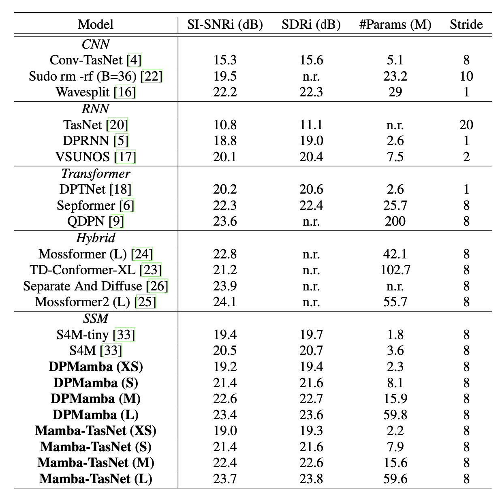

# Mamba-TasNet [](https://arxiv.org/abs/2407.09732) and Dual-Path Mamba [](https://arxiv.org/abs/2403.18257) 

An official implementation of Mamba-TasNet and dual-path Mamba for speech separation.

## Architectures


## Prerequisites

1. Download WSJ0 [corpus](https://catalog.ldc.upenn.edu/LDC93S6A) and follow an example [instruction](https://github.com/speechbrain/speechbrain/blob/develop/recipes/WSJ0Mix/separation/README.md) to create WSJ0-2Mix.

2. Install Packages.
```
conda create --name Slytherin python=3.9
conda activate Slytherin
pip install -r requirements.txt
```
You may need to install lower or higher versions of torch, torchaudio, causal-conv1d and mamba-ssm based on your hardware and system. Make sure they are compatible. 

## Training

```
python train_wsj0mix.py hparams/WSJ0Mix/{mambatasnet, dpmamba}_{XS, S, M, L}.yaml \
--data_folder </yourpath/wsj0-mix/2speakers> \
--dynamic_mixing True \
--base_folder_dm </yourpath/wsj0_processed/si_tr_s> \
--precision bf16
```

You might encounter numerical instablity in training L-sized model. 

We recommend training with fp32 if GPU memory permits.

Please check a related [issue](https://github.com/state-spaces/mamba/issues/6) and Section 6.4 in the Jamba [paper](https://arxiv.org/abs/2403.19887) on stabilizing loss.

## Inference and Checkpoints
You can download checkpoints from [Google drive](https://drive.google.com/drive/folders/1gHJJ0laJs7eZuHaeBjNBA5llTI99EzmS?usp=sharing) and put them in the ckpt folder.

See inference.ipynb for loading and running.

## Performance



## Acknowledgement

We acknowledge the wonderful work of [Mamba](https://arxiv.org/abs/2312.00752) and [Vision Mamba](https://arxiv.org/abs/2401.09417). We borrowed their implementation of [Mamba](https://github.com/state-spaces/mamba) and [bidirectional Mamba](https://github.com/hustvl/Vim). The training recipes are adapted from [SpeechBrain](https://speechbrain.github.io).

## Citation

If you find this work helpful, please consider citing:

```bibtex
@article{jiang2024speechslytherin,
      title={Speech Slytherin: Examining the Performance and Efficiency of Mamba for Speech Separation, Recognition, and Synthesis}, 
      author={Xilin Jiang and Yinghao Aaron Li and Adrian Nicolas Florea and Cong Han and Nima Mesgarani},
      year={2024},
      eprint={2407.09732},
      archivePrefix={arXiv},
      primaryClass={eess.AS},
      url={https://arxiv.org/abs/2407.09732}, 
}
```

```bibtex
@misc{jiang2024dual,
  title={Dual-path Mamba: Short and Long-term Bidirectional Selective Structured State Space Models for Speech Separation},
  author={Jiang, Xilin and Han, Cong and Mesgarani, Nima},
  journal={arXiv preprint arXiv:2403.18257},
  year={2024}
}
```

You may also like our Mamba for speech recognition : https://github.com/xi-j/Mamba-ASR
